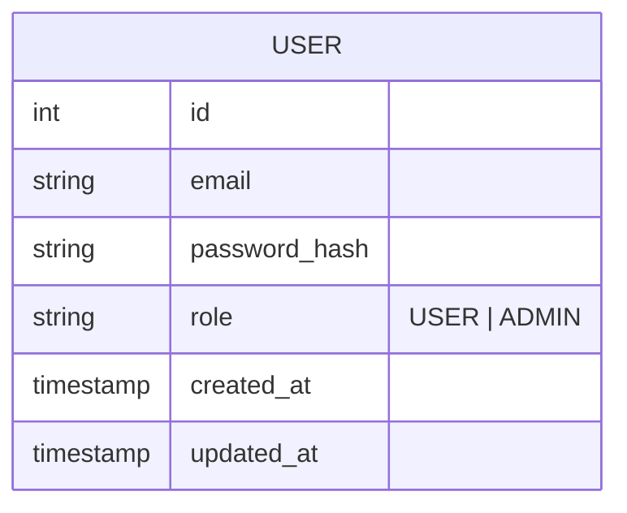

# auth-service

A JWT-based authentication microservice — registration, login, and token verification. Built on Node.js, Express, Prisma 7, and TypeScript with a SQLite database. It doesn't hold any domain data (owners, animals, vaccinations); it only knows about `User` accounts and issuing/verifying JWTs.

> Not yet wired into the [api-gateway-service](../api-gateway-service). See that service's README for how routes get proxied once this is integrated.

## Quick Start

### Prerequisites

- Node.js 18+
- npm

### Installation

```bash
npm install

# Create the database and run migrations
npm run prisma:migrate

npm run dev
```

The API will be available at `http://localhost:4000`.

### Build for Production

```bash
npm run build
npm start
```

### Docker

`.env` is not baked into the image — the container only gets `package.json`, `prisma/`, `src/`, and `entrypoint.sh` (see `Dockerfile`), so all environment variables must be passed in at `docker run` time. The image pre-creates `/data` for a mounted SQLite file:

```bash
docker build -t auth-service .
docker run -p 4000:4000 \
  -e DATABASE_URL=file:/data/database.sqlite \
  -e JWT_SECRET=change-me \
  -v $(pwd)/data:/data \
  auth-service
```

`entrypoint.sh` runs `prisma migrate deploy` before starting the compiled server, so migrations apply automatically on container start.

---

## Domain Model



Passwords are never stored in plain text — only a bcrypt hash (`password_hash`).

---

## Project Structure

```text
src/
├── server.ts               # App setup: middleware, route mounting, error handler
├── lib/
│   └── prisma.ts           # Shared Prisma client (SQLite adapter)
├── middleware/
│   ├── authenticate.ts     # Verifies the Bearer JWT, attaches req.user
│   └── errorHandling.ts    # HttpError, asyncHandler wrapper, central error handler
├── routes/
│   └── auth.ts             # POST /register, POST /login, GET /me
├── services/
│   └── UserService.ts      # register / login / findById + JWT signing
├── types/
│   └── index.ts            # JwtPayload, Role
└── validation/
    └── schemas.ts          # Zod schemas for register/login bodies

prisma/
├── schema.prisma           # Prisma data model (User)
└── migrations/

generated/
└── prisma/                 # Generated Prisma client (do not edit)

prisma.config.ts             # Prisma 7 configuration
Dockerfile                   # Alpine-based build for the production image
entrypoint.sh                # Runs pending migrations, then starts the server
```

---

## API Reference

Base URL: `http://localhost:4000`

### Auth

| Method | Path | Auth required | Description |
| --- | --- | --- | --- |
| POST | `/auth/register` | No | Create a user, returns a JWT |
| POST | `/auth/login` | No | Verify credentials, returns a JWT |
| GET | `/auth/me` | Yes (`Authorization: Bearer <token>`) | Returns the authenticated user |

**`POST /auth/register` / `POST /auth/login` request body:**

```json
{ "email": "vet@example.com", "password": "supersecret1" }
```

**Response (both routes):**

```json
{
  "token": "eyJhbGciOiJIUzI1NiIs...",
  "user": { "id": 1, "email": "vet@example.com", "role": "USER" }
}
```

`register` returns `409` if the email is already taken. `login` returns `401` for a wrong email or password — the same error either way, so the response doesn't reveal whether an account exists.

**`GET /auth/me` response:**

```json
{ "user": { "id": 1, "email": "vet@example.com", "role": "USER" } }
```

Returns `401` if the `Authorization` header is missing, malformed, or the token is invalid/expired.

### Health

```http
GET /health
→ { "status": "ok", "service": "auth-service", "environment": "development" }
```

---

## Error Responses

All errors return `{ "error": "<message>" }`.

| Status | Cause |
| --- | --- |
| 400 | Request body failed Zod validation (e.g. password under 8 characters) |
| 401 | Invalid credentials, or missing/invalid/expired JWT |
| 404 | User not found (`/auth/me` for a deleted user) |
| 409 | Email already registered |
| 500 | Server or database error |

---

## Environment Variables

```env
# Database
DATABASE_URL="file:./data/database.sqlite"

# Server
PORT=4000
NODE_ENV=development

# JWT
JWT_SECRET=dev-secret-change-in-production
JWT_EXPIRES_IN=7d
```

`JWT_SECRET` must be overridden with a real secret outside local development — the token is only as safe as this value.

---

## Dependencies

### Production

- **express** — web framework
- **@prisma/client** (v7) — database ORM
- **@prisma/adapter-better-sqlite3** — SQLite driver for Prisma 7
- **better-sqlite3** — SQLite native driver
- **bcryptjs** — password hashing
- **jsonwebtoken** — JWT signing and verification
- **zod** — runtime validation
- **cors** — CORS middleware
- **dotenv** — environment variable loading

### Development

- **prisma** (v7) — CLI for migrations and codegen
- **typescript** — TypeScript compiler
- **tsx** — TypeScript/ESM runner with watch mode, used for `npm run dev`

This service uses native ESM (`"type": "module"` + `moduleResolution: NodeNext`), unlike `registry` and `api-gateway-service` which use CommonJS — that's why it uses `tsx` for hot reload instead of `ts-node-dev` (which doesn't reliably support ESM).

---

## Available Scripts

```bash
npm run dev               # Start dev server with hot reload (tsx watch)
npm run build             # Compile TypeScript
npm start                 # Run compiled build

npm run prisma:migrate   # Run database migrations
npm run prisma:generate  # Regenerate Prisma client after schema changes
npm run prisma:studio    # Open Prisma Studio GUI
npm run type-check       # TypeScript check without building
```

---

## Security Notes

- Passwords hashed with bcrypt (cost factor 10) before storage — plain-text passwords never touch the database
- `login` runs the bcrypt comparison even when the user doesn't exist, so response timing doesn't leak whether an email is registered
- JWTs are signed with `JWT_SECRET` and expire after `JWT_EXPIRES_IN` (default 7 days)
- Input validated with Zod before reaching the database
- Prisma uses parameterized queries (SQL injection safe)
- CORS enabled — restrict origins before deploying to production

---

## License

MIT
