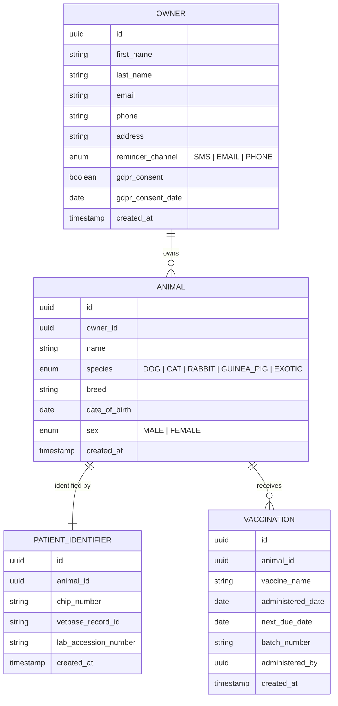
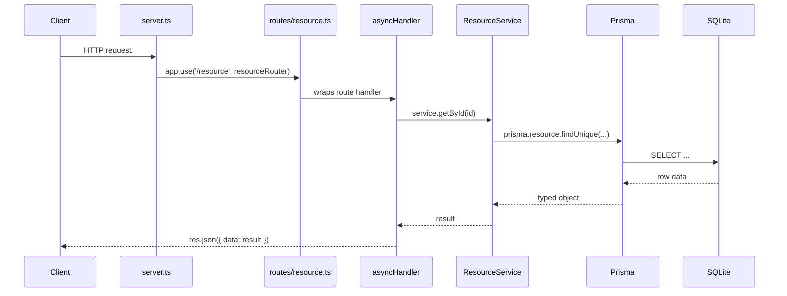
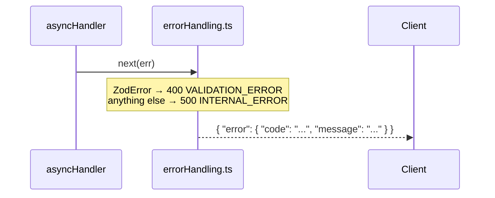

# Allegro — Veterinarian Registry API

A REST API for managing a veterinarian practice registry. Built on Node.js, Express, Prisma 7, and TypeScript with a SQLite database.

## Quick Start

### Prerequisites

- Node.js 18+
- npm

### Installation

```bash
npm install

# Create database and run migrations
npm run prisma:migrate

# Seed with sample data
npm run prisma:seed

npm run dev
```

The API will be available at `http://localhost:4000`.

### Build for Production

```bash
npm run build
npm start
```

---

## Domain Model



---

## Project Structure

```text
src/
├── server.ts              # App setup: middleware, route mounting, error handler
├── lib/
│   └── prisma.ts          # Shared Prisma client (SQLite adapter)
├── middleware/
│   └── errorHandling.ts   # asyncHandler wrapper + central error handler
├── routes/
│   ├── owners.ts          # GET /owners, GET /owners/:id
│   └── animals.ts         # GET /animals, GET /animals/:id
├── services/
│   ├── OwnerService.ts
│   ├── AnimalService.ts
│   └── index.ts
├── types/
│   └── index.ts           # TypeScript interfaces
└── validation/
    └── schemas.ts         # Zod validation schemas (extended as routes are added)

prisma/
├── schema.prisma          # Prisma data model
└── seed.ts                # Database seed script

src/generated/
└── prisma/                # Generated Prisma client (do not edit)

prisma.config.ts           # Prisma 7 configuration
```

---

## API Reference

Base URL: `http://localhost:4000`

All successful responses follow the OAS-aligned envelope format:

```json
{ "data": { ... } }
```

List responses include a `meta` object:

```json
{ "data": [...], "meta": { "count": 3 } }
```

### Owners

| Method | Path | Description |
| --- | --- | --- |
| GET | `/owners` | List all owners (includes their animals) |
| GET | `/owners/:id` | Get an owner with full animal details, identifiers, and vaccinations |

**`GET /owners` response:**

```json
{
  "data": [
    {
      "id": "550e8400-e29b-41d4-a716-446655440000",
      "firstName": "Anke",
      "lastName": "Meijer",
      "email": "a.meijer@gmail.com",
      "phone": "+31612345678",
      "address": "Kerkstraat 14, 1234 AB Amsterdam",
      "reminderChannel": "EMAIL",
      "gdprConsent": true,
      "gdprConsentDate": "2024-03-01T00:00:00.000Z",
      "createdAt": "2026-06-29T14:43:00.000Z",
      "animals": [...]
    }
  ],
  "meta": { "count": 3 }
}
```

### Animals

| Method | Path | Description |
| --- | --- | --- |
| GET | `/animals` | List all animals (includes owner and patient identifier) |
| GET | `/animals/:id` | Get an animal with owner, patient identifier, and vaccination history |

**`GET /animals/:id` response:**

```json
{
  "data": {
    "id": "660e8400-e29b-41d4-a716-446655440001",
    "ownerId": "550e8400-e29b-41d4-a716-446655440000",
    "name": "Luna",
    "species": "DOG",
    "breed": "Golden Retriever",
    "dateOfBirth": "2020-04-12T00:00:00.000Z",
    "sex": "FEMALE",
    "createdAt": "2026-06-29T14:43:00.000Z",
    "owner": { ... },
    "patientIdentifier": {
      "chipNumber": "528210000123456",
      "vetbaseRecordId": "VB-2024-00142",
      "labAccessionNumber": null
    },
    "vaccinations": [
      {
        "vaccineName": "Hondsdolheid (Rabiës)",
        "administeredDate": "2024-05-10T00:00:00.000Z",
        "nextDueDate": "2027-05-10T00:00:00.000Z",
        "batchNumber": "RB-2024-A11"
      }
    ]
  }
}
```

### Health

```http
GET /health
→ { "status": "ok", "environment": "development" }
```

---

## Error Responses

All errors return a structured `error` object:

```json
{
  "error": {
    "code": "NOT_FOUND",
    "message": "Owner not found"
  }
}
```

| Status | Code | Meaning |
| --- | --- | --- |
| 404 | `NOT_FOUND` | Resource does not exist |
| 400 | `VALIDATION_ERROR` | Request body failed Zod validation |
| 500 | `INTERNAL_ERROR` | Server or database error |

---

## Adding a New Route

Every route follows the same four-file pattern: service → router → mount → (schema when writes are needed).

### Request flow



### Error flow

When anything throws, `asyncHandler` forwards it to the central error handler — no per-route try/catch needed.



### Step-by-step example: Vaccinations

**1. Create the service** at `src/services/VaccinationService.ts`:

```ts
import { prisma } from '../lib/prisma';

export class VaccinationService {
  async getByAnimalId(animalId: string) {
    return prisma.vaccination.findMany({
      where: { animalId },
      orderBy: { administeredDate: 'desc' },
    });
  }
}

export const vaccinationService = new VaccinationService();
```

Export it from `src/services/index.ts`:

```ts
export { vaccinationService } from './VaccinationService';
```

**2. Create the route file** at `src/routes/vaccinations.ts`:

```ts
import { Router } from 'express';
import { vaccinationService } from '../services';
import { asyncHandler } from '../middleware/errorHandling';

export const vaccinationsRouter = Router();

vaccinationsRouter.get('/animals/:animalId/vaccinations', asyncHandler(async (req, res) => {
  const vaccinations = await vaccinationService.getByAnimalId(req.params.animalId);
  res.json({ data: vaccinations, meta: { count: vaccinations.length } });
}));
```

**3. Mount it** in `src/server.ts`:

```ts
import { vaccinationsRouter } from './routes/vaccinations';

app.use('/', vaccinationsRouter);
```

---

## Available Scripts

```bash
npm run dev              # Start dev server with hot reload
npm run build            # Compile TypeScript
npm start                # Run compiled build

npm run prisma:migrate   # Run database migrations
npm run prisma:seed      # Seed sample data
npm run prisma:generate  # Regenerate Prisma client after schema changes
npm run prisma:studio    # Open Prisma Studio GUI
npm run type-check       # TypeScript check without building
```

---

## Environment Variables

```env
DATABASE_URL="file:./database.sqlite"
PORT=4000
NODE_ENV=development
```

---

## Dependencies

### Production

- **express** — web framework
- **@prisma/client** (v7) — database ORM
- **@prisma/adapter-better-sqlite3** — SQLite driver for Prisma 7
- **better-sqlite3** — SQLite native driver
- **zod** — runtime validation
- **cors** — CORS middleware
- **dotenv** — environment variable loading

### Development

- **prisma** (v7) — CLI for migrations and codegen
- **typescript**, **ts-node**, **ts-node-dev** — TypeScript tooling

---

## Future Upgrades

A few dependency upgrades were deliberately held back (as of 2026-09) because they're either not stable yet or require code changes beyond a version bump:

- **Prisma 8** — still in RC (`8.0.0-rc.x`) as of this writing, with breaking changes still landing between candidates (config file format, CLI command paths, env var names, SQL type-generic signature). Wait for GA before migrating.
- **TypeScript 7** — ships with no programmatic compiler API until 7.1, which breaks `ts-node`/`ts-node-dev` (used by `npm run dev` and `npm run prisma:seed`). Either wait for 7.1 or migrate off `ts-node`/`ts-node-dev` (e.g. to `tsx`) first.
- **Express 5** — major version with breaking changes to error handling and route syntax; needs a reviewed migration, not a routine bump.
- **Zod 4** — major version with an API rewrite affecting `src/validation/schemas.ts`; needs a reviewed migration, not a routine bump.

The `deepmerge-ts`/`mysql2` `overrides` in `package.json` patch high-severity CVEs in Prisma's own bundled CLI dependencies (unrelated to this project's SQLite setup) — they can likely be dropped once Prisma 8 GA is adopted, since that release restructures the CLI away from those packages.

---

## Sample Data

The seed script populates the registry with realistic Dutch veterinary data:

- **3 owners** (Anke Meijer, Pieter van den Berg, Fatima de Jong) with GDPR consent records
- **5 animals** across species: 2 dogs, 2 cats, 1 rabbit
- **5 patient identifiers** — chip numbers, VetBase IDs, and lab accession numbers where applicable
- **8 vaccinations** — including Rabiës, Parvo, Myxomatose, FeLV, and Leptospirose

---

## Security Notes

- Input validated with Zod before reaching the database
- Prisma uses parameterized queries (SQL injection safe)
- CORS enabled — restrict origins before deploying to production
- GDPR consent date recorded per owner

---

## License

MIT
