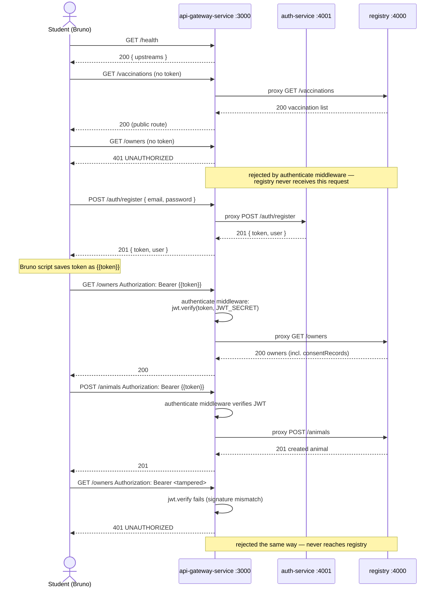

# Test Scenario — Auth + API Gateway (Bruno)

A manual/scripted test scenario for [Bruno](https://www.usebruno.com/) (an open-source, offline-first alternative to Postman) that exercises the JWT authentication wired into `api-gateway-service` in [assignments.md](assignments.md) / [assignments-answers.md](assignments-answers.md). Work through the requests **in order** — later ones depend on variables captured by earlier ones.

This complements `api-gateway-service/test-api.js` (a scripted Node test suite covering the same scenario) — use this document if you'd rather drive it by hand in a GUI client and *see* each request/response, which is a better way to build intuition for what's actually happening than reading a test runner's pass/fail output.

---

## What this tests

- Public routes work without a token (`/health`, `/vaccinations`, `/auth/register`, `/auth/login`)
- Protected routes (`/owners`, `/animals`) reject requests with no token
- Protected routes accept requests with a valid token, and the response is the real data proxied from `registry`
- A tampered token is rejected the same way a missing one is
- The write path (`POST /animals`) is gated the same as reads — this isn't a "public read, protected write" API, see `api-gateway-service/README.md`'s "Authentication" section for why

---

## Prerequisites

All three services running locally, each in its own terminal:

```bash
cd registry && npm run dev            # http://localhost:4000
cd auth-service && npm run dev        # http://localhost:4001
cd api-gateway-service && npm run dev # http://localhost:3000
```

Confirm the gateway sees both upstreams before starting:

```bash
curl http://localhost:3000/health
```

should return `upstreams.registryService` and `upstreams.authService`.

---

## 1. Set up the Bruno collection

1. **New Collection** → name it e.g. `vet-backend-gateway`.
2. **Create an environment** (top-right environment selector → *Configure* → *Create Environment*) named `local`, with one variable:

   | Variable | Value |
   | --- | --- |
   | `baseUrl` | `http://localhost:3000` |

   Every request below targets `{{baseUrl}}` — never `localhost:4000`/`4001` directly. The whole point is testing the *gateway's* behavior, including the cases where it's supposed to reject a request before `registry`/`auth-service` ever see it.
3. Select the `local` environment (top-right dropdown) before running anything.

Name the requests with a numeric prefix (`01_health`, `02_...`) so Bruno's **Runner** can execute the whole collection top-to-bottom later (see [§4](#4-running-the-whole-thing-as-a-suite-bruno-runner)).

---

## 2. Sequence diagram



---

## 3. Requests, in order

For each request: create it in Bruno with the given method/URL/headers/body, add the **Script → Post Response** snippet (if any) under the request's *Script* tab, and add the **Tests** under the *Tests* tab (Bruno's test blocks use `test(name, fn)` + `expect`, in the same style as Postman/Chai — adjust to whatever your installed Bruno version's editor autocompletes if the exact API differs slightly).

### 01 — Health check

```
GET {{baseUrl}}/health
```

**Tests:**
```js
test("status is 200", function() {
  expect(res.getStatus()).to.equal(200);
});
test("both upstreams are reported", function() {
  expect(res.getBody().upstreams).to.have.property('registryService');
  expect(res.getBody().upstreams).to.have.property('authService');
});
```

### 02 — Public route without a token

```
GET {{baseUrl}}/vaccinations
```

**Tests:**
```js
test("public route works with no Authorization header", function() {
  expect(res.getStatus()).to.equal(200);
});
```

### 03 — Protected route without a token (expect rejection)

```
GET {{baseUrl}}/owners
```

**Tests:**
```js
test("protected route rejects a request with no token", function() {
  expect(res.getStatus()).to.equal(401);
  expect(res.getBody().error.code).to.equal('UNAUTHORIZED');
});
```

Cross-check: at this point, `registry`'s own terminal log should **not** show a `GET /owners` line — the gateway rejected this before proxying it.

### 04 — Register

A fresh email is needed each run (the `email` column is unique in `auth-service`'s database) — generate one in a **Pre Request** script:

```js
// Script → Pre Request
bru.setVar('testEmail', `bruno-${Date.now()}@example.com`);
```

```
POST {{baseUrl}}/auth/register
Content-Type: application/json

{
  "email": "{{testEmail}}",
  "password": "supersecret1"
}
```

**Script → Post Response:**
```js
bru.setVar('token', res.getBody().token);
```

**Tests:**
```js
test("register returns 201 with a token", function() {
  expect(res.getStatus()).to.equal(201);
  expect(res.getBody().token).to.be.a('string');
  expect(res.getBody().user.email).to.equal(bru.getVar('testEmail'));
});
```

### 05 — Login (same credentials, fresh token)

```
POST {{baseUrl}}/auth/login
Content-Type: application/json

{
  "email": "{{testEmail}}",
  "password": "supersecret1"
}
```

**Script → Post Response:**
```js
bru.setVar('token', res.getBody().token); // overwrite with the freshly issued token
```

**Tests:**
```js
test("login returns 200 with a token", function() {
  expect(res.getStatus()).to.equal(200);
  expect(res.getBody().token).to.be.a('string');
});
```

### 06 — `/auth/me` (proxied through the gateway, checked by auth-service itself)

```
GET {{baseUrl}}/auth/me
Authorization: Bearer {{token}}
```

**Tests:**
```js
test("me returns the registered user", function() {
  expect(res.getStatus()).to.equal(200);
  expect(res.getBody().user.email).to.equal(bru.getVar('testEmail'));
});
```

### 07 — Protected route WITH a valid token

```
GET {{baseUrl}}/owners
Authorization: Bearer {{token}}
```

**Script → Post Response** (captures a real `ownerId` for the write-path test below):
```js
bru.setVar('ownerId', res.getBody().data[0].id);
```

**Tests:**
```js
test("protected route succeeds with a valid token", function() {
  expect(res.getStatus()).to.equal(200);
  expect(res.getBody().data).to.be.an('array');
});
```

### 08 — Write path WITH a valid token

```
POST {{baseUrl}}/animals
Content-Type: application/json
Authorization: Bearer {{token}}

{
  "ownerId": "{{ownerId}}",
  "name": "BrunoTestAnimal",
  "species": "CAT",
  "dateOfBirth": "2022-01-01",
  "sex": "MALE"
}
```

**Script → Post Response:**
```js
bru.setVar('animalId', res.getBody().data.id);
```

**Tests:**
```js
test("authenticated write succeeds and is really proxied to registry", function() {
  expect(res.getStatus()).to.equal(201);
  expect(res.getBody().data.name).to.equal('BrunoTestAnimal');
});
```

### 09 — Write path WITHOUT a token (expect rejection)

```
POST {{baseUrl}}/animals
Content-Type: application/json

{
  "ownerId": "{{ownerId}}",
  "name": "ShouldNeverBeCreated",
  "species": "CAT",
  "dateOfBirth": "2022-01-01",
  "sex": "MALE"
}
```

**Tests:**
```js
test("write path rejects a request with no token", function() {
  expect(res.getStatus()).to.equal(401);
});
```

Cross-check: `registry` should show no evidence this animal was created — it never received the request.

### 10 — Tampered token (expect rejection)

```
GET {{baseUrl}}/owners
Authorization: Bearer {{token}}TAMPERED
```

(Appending characters to a real token invalidates its signature — `jwt.verify` fails the same as it would for a fully invalid token.)

**Tests:**
```js
test("a tampered token is rejected", function() {
  expect(res.getStatus()).to.equal(401);
  expect(res.getBody().error.message).to.equal('Invalid or expired token');
});
```

### 11 — Cleanup: delete the test animal

```
DELETE {{baseUrl}}/animals/{{animalId}}
Authorization: Bearer {{token}}
```

**Tests:**
```js
test("cleanup: test animal is soft-deleted", function() {
  expect(res.getStatus()).to.equal(200);
  expect(res.getBody().data.deleted).to.equal(true);
});
```

`registry` never hard-deletes (see root `README.md` section 7), so this marks the animal `deleted: true` rather than removing it — acceptable for a test run, but don't skip it, or `registry`'s sample data accumulates a `BrunoTestAnimal` per run.

There's no equivalent cleanup for the registered test user — `auth-service` has no delete-user endpoint. That's fine for local testing (the timestamp-suffixed email in step 04 means re-running never collides), but worth noting if this ever runs against a shared environment.

---

## 4. Running the whole thing as a suite (Bruno Runner)

Once all 11 requests exist with their scripts/tests, open **Runner** (sidebar) → select the collection → select the `local` environment → **Run**. Bruno executes them in the order shown in the sidebar (hence the numeric prefixes) and reports pass/fail per request, plus per-`test()` results within each.

---

## Definition of done

| # | Request | Expect |
| --- | --- | --- |
| 01 | `GET /health` | `200`, both upstreams listed |
| 02 | `GET /vaccinations` (no token) | `200` |
| 03 | `GET /owners` (no token) | `401 UNAUTHORIZED` |
| 04 | `POST /auth/register` | `201`, token issued |
| 05 | `POST /auth/login` | `200`, token issued |
| 06 | `GET /auth/me` (token) | `200`, correct email |
| 07 | `GET /owners` (token) | `200`, real data from `registry` |
| 08 | `POST /animals` (token) | `201`, animal created |
| 09 | `POST /animals` (no token) | `401`, nothing created |
| 10 | `GET /owners` (tampered token) | `401 UNAUTHORIZED` |
| 11 | `DELETE /animals/:id` (token) | `200`, `deleted: true` |

All 11 green, with `registry`'s own terminal log showing no entry for steps 03, 09, or 10 — that last check is the one a passing HTTP status code alone can't prove, and is the actual point of gating at the gateway instead of trusting each service to check for itself.
